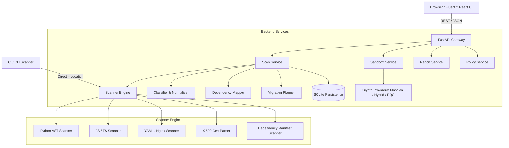

# PQC Migration & Crypto-Agility Scanner - System Architecture

## 1. High-Level Architecture

The platform consists of a modern Fluent 2 React frontend, a FastAPI modular backend, a multi-language AST/rule scanner engine, and an isolated crypto-agility sandbox.

## 2. Core Modules

### 2.1 Scanner Engine
- **AST Parsing**: Inspects Python abstract syntax trees for direct cryptographic calls (`RSA.generate`, `AES.new`, `jwt.encode`).
- **Config & Manifests**: Scans YAML, JSON, `.env`, Nginx configurations, `requirements.txt`, and `package.json`.
- **Certificates**: Uses `cryptography.x509` to extract public keys, signature algorithms, fingerprints, and validity dates without exposing private keys.

### 2.2 Classification & Analysis
- **Confidence Model**: Strictly categorizes findings as Confirmed, Likely, Possible, or Unknown.
- **Dependency Mapper**: Assembles bipartite and multi-tier graphs connecting services, protocols, algorithms, and certificates.
- **Migration Planner**: Generates prioritized tasks with 8 standard validation gates.

### 2.3 Crypto-Agility Sandbox
- **Interface**: Abstract `CryptoProvider` base class.
- **Providers**: Classical (RSA-PSS, ECDSA), Hybrid (Composite ECDSA + ML-DSA-65), and Pure PQC (ML-DSA-65 / FIPS 204).
- **Benchmarking**: Quantifies signature sizes (256B vs ~3.4KB) and latency trade-offs.
